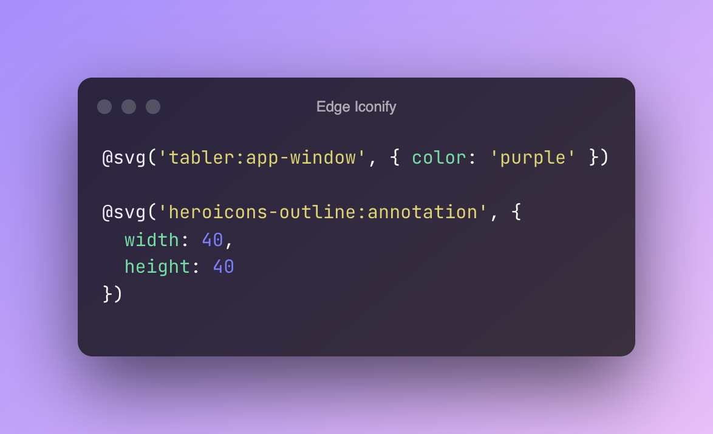

Edge Iconify
> Iconify integration for Edge template engine



[Iconify](https://icon-sets.iconify.design/) is a great collection of over 100 oepn source icon sets. This package allows you to use all the available icons within edge templates.

## Not using the online mode
Iconify support various icon loading strategies and the most prominent one on their website is the online API. During the online API, the Iconify will make an HTTP call to their API server and returns the icon data in response.

The online API is not really useful on the backend, since bundle size is not really an issue on the server. Also, many companies restricts the outgoing traffic on their production servers and therefore the requests to Iconify API server will fail.

## Using icon bundles
Icon bundles on the other hand are pre-bundled icon sets in JSON files. Iconify has an npm package for every single icon set they support and therefore using them is quite easy.

## Setup
The first step is to install the `edge-iconify` package from the npm registry.

```sh
npm i edge-iconify
```

Register the plugin with the template engine. AdonisJS users can use the `View` object for the same.

```ts
import View from '@ioc:Adonis/Core/View'
import { edgeIconify } from 'edge-iconify'

View.use(edgeIconify)
```

That's all you need to do and you are ready to render SVG icons within your edge templates.

## Setup icon bundles
Before you can render icons, you will have to install the icon set you are planning to use. You can also use multiple icon sets in a single projects.

For this example, we will setup the following two icon sets.

- [HeroIcons Outline](https://icon-sets.iconify.design/heroicons-outline/)
- [Tabler Icons](https://icon-sets.iconify.design/tabler/)

```sh
npm i @iconify-json/heroicons-outline
npm i @iconify-json/tabler
```

Next, use the `addCollection` method exported by the `edge-iconify` package.

```ts
import { addCollection } from 'edge-iconify'
import { icons as tablerIcons } from '@iconify-json/tabler'
import { icons as heroIcons } from '@iconify-json/heroicons-outline'

addCollection(heroIcons)
addCollection(tablerIcons)
```

## Rendering icons
Once, you have installed the icon bundles of your choice. You can render the icons as follows.

```edge
@svg('tabler:app-window', { color: 'purple' })
@svg('heroicons-outline:annotation', { width: 40, height: 40 })
```

Also, you can render the icons using the `svg` global method.

```edge
<a href="">Click here {{ svg('heroicons-outline:arrow-sm-right') }}</a>
```
